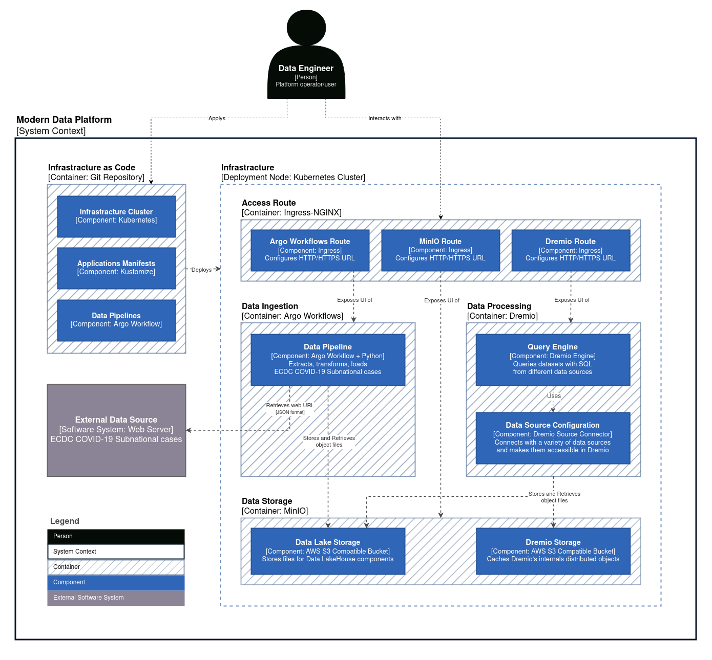
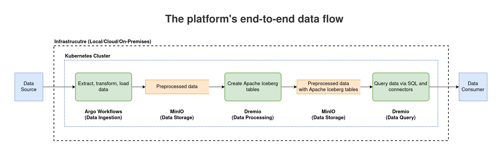

# Research Paper - Building A Modern Data Platform Based On The Data Lakehouse Architecture And Cloud-Native Ecosystem

The resources for the research paper `Building A Modern Data Platform Based On The Data Lakehouse Architecture And Cloud-Native Ecosystem`, a proof of concept for the core of Modern Data Platform using DataOps, Kubernetes, and Cloud-Native ecosystem
to build a resilient Big Data platform based on Data Lakehouse architecture, which is the base for
Machine Learning (MLOps) and Artificial Intelligence (AIOps).

## Contents

- [Architecture](#architecture)
- [Infrastructure](#infrastructure)
- [Applications](#applications)
- [Pipelines](#pipelines)
- [Benchmarking](#benchmarking)

## Architecture

### Core Components

The core components of the platform are:

- Infrastructure (Kubernetes)
- Data Ingestion (Argo Workflows + Python)
- Data Storage (MinIO)
- Data Processing/Query (Dremio)

### Initial Model

To visualise the interactions of the current implementation, the
[C4 software architecture model](https://c4model.com/) (Context, Containers, Components, and Code)
is used.

The following is a simplified view of the initial architecture model
(all the abstractions are combined together).






## Prerequisites

[ASDF](https://asdf-vm.com/), Linux operating system, and Docker Engine
(tested with asdf 0.11.1, Ubuntu 20.04.5 LTS, and Docker Engine Community 23.0.1).

The following tools are used in the development:
- Helm
- Kubectl
- Kustomize

They could be installed with corresponding versions via `asdf`:

```shell
asdf install
```

## Clusters

Check the [clusters section](./clusters) for more details about the infrastructure setup.

## Applications

Check the [applications section](./applications) for more details about the application setup.

## Pipelines

Check the [pipelines section](./pipelines) for more details about the pipeline setup.

## Benchmarking

Check the [benchmarking section](./benchmarking) for more details about the pipeline setup.

<p align="center">
  
</p>

## Author Contributions

**Ahmed AbouZaid**: Conceptualization, Methodology, Software, Validation, Data curation, Writing–original draft, Writing–review & editing. **Peter J. Barclay**: Conceptualization, Methodology, Writing–review & editing, Supervision. **Christos Chrysoulas**: Conceptualization, Writing–review & editing. **Nikolaos Pitropakis**: Conceptualization, Writing–review & editing.
