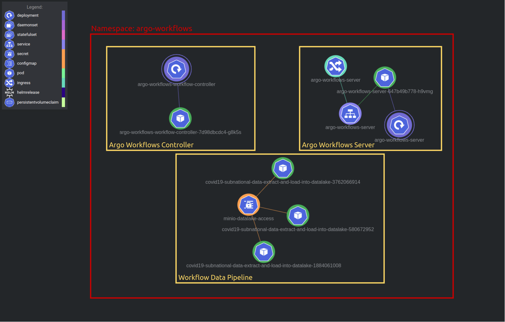
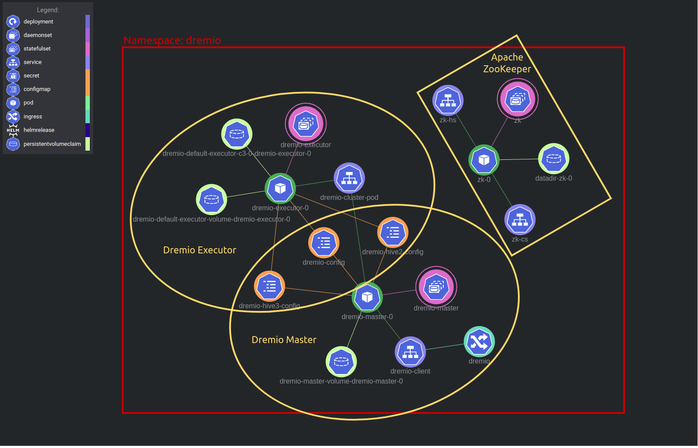
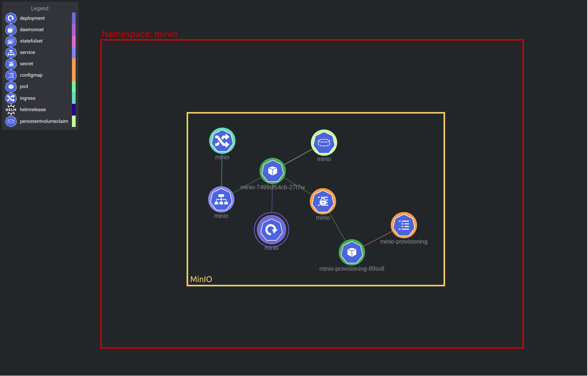

# Applications

This section covers the application deployment after the cluster creation (mentioned in the [cluster infrastructure section](../clusters/README.md)).

## Resources

The following table shows the resources used for each application component.

|Component          |CPU |RAM |Disk |
|-------------------|----|----|-----|
|Dremio Master      |4   |8G  |10G  |
|Dremio Executor    |4   |8G  |10G  |
|Dremio ZooKeeper   |1   |1G  |1G   |
|MinIO              |2   |4G  |250G |
|Argo Workflows     |1   |1G  |10G  |

## Deployment

Connect to the Kubernetes cluster that was created in the [cluster infrastructure section](../clusters/README.md):

Deploy the applications to the Kubernetes cluster:

```shell
kustomize build --enable-helm applications | kubectl apply -f -
```

Wait for deployments to be ready:

```shell
# Ingress-Nginx.
kubectl rollout status deployment \
  --watch --namespace ingress-nginx ingress-nginx-controller

# MinIO.
kubectl rollout status deployment \
  --watch --namespace minio minio

# Argo Workflows.
kubectl rollout status deployment \
  --watch --namespace argo-workflows argo-workflows-server

# Dremio.
kubectl rollout status statefulset \
  --watch --namespace dremio dremio-master
```

<p align="center">
  
  
  
</p>