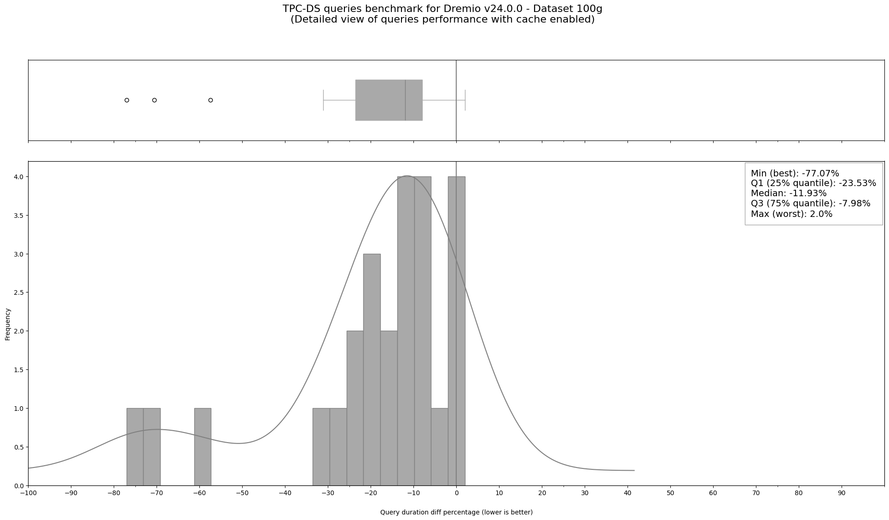

# Benchmarking

This is a performance comparison between cold queries (without cache) and warm queries (with cache)
based on the Apache JMeter benchmark results.

[TPC-DS](https://www.tpc.org/tpcds/)  test suite has been used
to assess the preliminary platform's performance. And the TPC-DS benchmark data
for Dremio was generated according to this guide:
[Dremio Benchmarking Methodology – How to Do It Yourself](https://www.dremio.com/blog/dremio-benchmarking-methodology/)

## Resources

The following table shows the resources used for each application component.

|Component          |CPU |RAM |Disk |
|-------------------|----|----|-----|
|Dremio Master      |4   |8G  |10G  |
|Dremio Executor    |4   |8G  |10G  |
|Dremio ZooKeeper   |1   |1G  |1G   |
|MinIO              |2   |4G  |250G |
|Apache JMeter      |4   |8G  |200G |

## Deployment

The first step is to deploy JMeter StatefulSet, which will generate the data and execute the benchmark.

The deployment is already part of the [GCP cluster setup](../clusters/gcp), but it could also be deployed independently:

```shell
kustomize build --enable-helm jmeter | kubectl apply -f -
```

## Data Generation

As stated in the guide [Dremio Benchmarking Methodology – How to Do It Yourself](https://www.dremio.com/blog/dremio-benchmarking-methodology/), only fifty-six queries worked out of ninety-nine queries without making any changes in the queries, and the rest of the queries need some logical query rewrites to work. Even so, for this research project, the benchmark will use the fifty-six out-of-the-box queries. Furthermore, the benchmarking will use a dataset of 100 gigabytes, which is considered a relatively small dataset for Data Lake/Lakehouse. Still, it will provide a baseline for Dremio’s performance, especially with limited computing resources. The next code block shows the command to generate the dataset using the `dsdgen` CLI tool part of the TPC-DS suite.

First, get the TPC-DS tools from the TPC download page.

Then, copy the TPC-DS archive to the JMeter Pod:

```shell
kubectl cp ~TPC-DS_Tools_v3.2.0.zip jmeter-0:/tmp/TPC-DS-Tool.zip
```

Then, exec to the JMeter Pod and extract and build the TPC-DS tools:

```shell
kubectl exec -it jmeter-0 bash

cd /tmp
unzip TPC-DS-Tool.zip
mv DSGen* tpc-ds
cd tpc-ds/tools
make
```

Finally, you should be able to run the following command to generate the 100G dataset.

```shell
./dsdgen -scale 100 -f -dir /mnt/test-data/100g -terminate n 
```

After the data generation, add the headers to all files following the items in [DatasetHeaders](https://github.com/sergeleo/dremio-tpc-ds/tree/4096798/Scripts/TPC-DS%20Data%20Prep/DatasetHeaders).


## Data Initialisation

After the data was generated, based on the benchmark guide, the steps were followed: adding CVS headers to the data files, uploading them to the MinIO bucket, loading them in Dremio, and finally creating them as datasets in Apache Iceberg format.

### Copy generated data to MinIO

Upload the generated files to MinIO:

```shell
# MinIO client is already configured in JMeter deployment.
# More details in: benchmarking/jmeter/statefulset.yaml
mc cp --recursive /mnt/test-data/100g/*.csv modern-data-platform/datalake/100g/
```

### Configure MinIO in Dremio

After the data is uploaded, the next step is to initialise the data in Dremio. First create the admin user, and add MinIO as a data source:

<p align="center">
  
  
  <br/>
</p>

### Promote CSV files to Data Set

CSV files could be easily promoted to Data Set in Dremio via REST API. Inside JMeter Pod, run the following:

```shell
cd /mnt/test-plan
bash promoteCSVtoPDS.sh
```

In Dremio UI, the CSV files' icon will appear in purple as a sign of data set creation.

### Create Apache Iceberg tables

The final step in the data initialisation is to create Apache Iceberg tables. Go to Dremio Console, and exec the [CTAS SQL file](./jmeter/files/CTAS.sql) content.

This process will take around 1-2 hours.

## Benchmark Execution

Once the data is initialised, the next step is to run the benchmark, which will be executed three times (later, the average will be calculated in the Jupyter Notebook).

In the JMeter Pod, exec the benchmark script:

```shell
kubectl exec -it jmeter-0 bash

bash /mnt/test-plan/runDremioBenchmark.sh > jmeter-output.txt
```

Copy the results files:
```
jmeter-output.txt
/mnt/test-plan/dremio-v24.0.0-tpc-ds-100g-cold.csv
/mnt/test-plan/dremio-v24.0.0-tpc-ds-100g-warm.csv
```

Restart the JMeter Pod:

```shell
kubectl delete pod jmeter-0
```

Redo the same steps and run the test again 2 times.

## Visualisation

<p align="center">
  
  <br/>
  Queries performance with cache enabled (median time enhancement 33%)
</p>

For complete results, please check the project [Jupyter Notebook](dremio_v24_0_0_tpc_ds_benchmark.ipynb).
